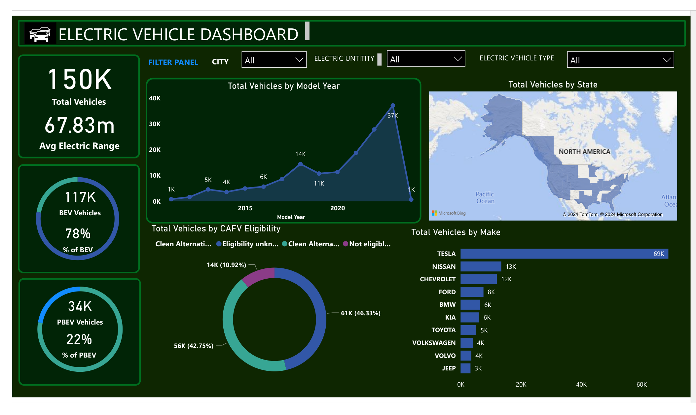

# ⚡ Electric Vehicle Population Dashboard — Power BI


An interactive Power BI dashboard that explores the adoption, composition, and growth of the
electric-vehicle (EV) market using real registration data of **150,000+ vehicles**. The report
turns a raw, messy dataset into a single-page analytical story covering market size, technology
maturity (electric range), the BEV-vs-PHEV split, leading manufacturers, geographic spread, and
clean-fuel eligibility.

---

## 📊 Dashboard Preview



> Single-page, fully interactive report built in Power BI Desktop. Slicers for **City**,
> **Electric Utility**, and **Electric Vehicle Type** cross-filter every visual on the page.

---

## 🎯 Problem Statement

- Understand the overall landscape of electric vehicles — covering both **Battery Electric
  Vehicles (BEVs)** and **Plug-in Hybrid Electric Vehicles (PHEVs)** — to assess the market's
  size and growth.
- Measure the **average electric range** of vehicles in the dataset to gauge technological
  progress and efficiency.
- Quantify and compare the **share of BEVs vs PHEVs**, and identify the leading manufacturers and
  regions driving adoption.

---

## ✨ Features

- **KPI cards** — total vehicles, average electric range, BEV/PHEV counts and percentage split.
- **Trend analysis** — total vehicles by model year, revealing the adoption curve over time.
- **Manufacturer ranking** — top EV makes by volume.
- **Geographic distribution** — vehicles mapped by location.
- **Clean-fuel eligibility breakdown** — CAFV eligibility as a share of the fleet.
- **Interactive slicers** — City, Electric Utility, and Electric Vehicle Type filter the full page.

---

## 💡 Key Insights

| Metric | Value |
| --- | --- |
| Total vehicles analysed | **150K** |
| Average electric range | **67.83 miles** |
| Battery Electric Vehicles (BEV) | **117K (78%)** |
| Plug-in Hybrid Electric Vehicles (PHEV) | **34K (22%)** |
| Peak adoption year | **2021 (~37K vehicles)** |
| Leading manufacturer | **Tesla (69K — ~46% of all EVs)** |

- **BEVs dominate the fleet.** Roughly 4 in 5 registered EVs are fully battery-electric (78%),
  with plug-in hybrids making up the remaining 22% — a clear signal of the market's shift toward
  pure electric powertrains.
- **Adoption accelerated sharply after 2020,** peaking in **2021** with about **37K** vehicles
  registered in a single model year.
- **Tesla leads by a wide margin** with ~69K vehicles, followed by Nissan (~13K), Chevrolet
  (~12K), Ford (~8K), and BMW/Kia (~6K each).
- **Clean-fuel eligibility is mixed:** only **42.75%** of vehicles are confirmed *Clean
  Alternative Fuel Vehicle (CAFV) eligible*, while **46.33%** have unknown eligibility (battery
  range not yet researched) and **10.92%** are not eligible due to low electric range.

---

## 🗂️ Dataset

The dashboard is built on the **Electric Vehicle Population dataset**, which catalogs battery and
plug-in hybrid electric vehicles registered through the Washington State Department of Licensing.

- **Records:** 150,000+ vehicles
- **Format:** CSV (provided compressed in [`data/`](data/))
- **Source:** [Electric Vehicle Population — Kaggle](https://www.kaggle.com/datasets/willianoliveiragibin/electric-vehicle-population)

Key columns include: `Model Year`, `Make`, `Model`, `Electric Vehicle Type` (BEV/PHEV),
`Electric Range`, `City`/`County`/`State`, `Electric Utility`, and
`Clean Alternative Fuel Vehicle (CAFV) Eligibility`. See [`data/README.md`](data/README.md) for
the full data dictionary.

---

## 🛠️ Tech Stack

- **Power BI Desktop** — data modeling, visualization, and report design
- **Power Query (M)** — data import, cleaning, and transformation
- **DAX** — calculated measures and KPIs
- **Dataset** — CSV (Electric Vehicle Population data)

---

## 🔧 How It Was Built

1. **Data collection** — sourced the Electric Vehicle Population dataset (CSV).
2. **Load into Power BI** — imported the CSV into Power BI Desktop.
3. **Inspect in Power Query Editor** — profiled columns, types, and data quality.
4. **Clean & transform** — handled missing values, fixed data types, and standardized fields so
   the model is accurate and analysis-ready.
5. **Model & measure** — created DAX measures for KPIs such as total vehicles, BEV/PHEV split, and
   average electric range.
6. **Visualize** — designed a single-page interactive report with KPI cards, trend, ranking, map,
   and eligibility visuals plus cross-filtering slicers.

---

## 📁 Project Structure

```
EV-Dashboard-PowerBI/
├── README.md
├── LICENSE
├── .gitignore
├── assets/
│   └── dashboard.png                     # Dashboard preview image
├── dashboard/
│   └── EV_Population_Dashboard.pbix       # Power BI report file
├── data/
│   ├── README.md                         # Data dictionary
│   └── Electric_Vehicle_Population_Data.zip
└── docs/
    └── EV_Population_Dashboard.pdf        # Static PDF export of the report
```

---

## 🚀 Getting Started

### Prerequisites
- [Power BI Desktop](https://powerbi.microsoft.com/desktop/) (free) — Windows.

### View the report
1. Clone the repository:
   ```bash
   git clone https://github.com/<your-username>/EV-Dashboard-PowerBI.git
   ```
2. Open `dashboard/EV_Population_Dashboard.pbix` in **Power BI Desktop**.
3. Interact with the slicers and visuals to explore the data.

### Reproduce from raw data
1. Unzip `data/Electric_Vehicle_Population_Data.zip` to get the CSV.
2. In Power BI Desktop: **Home → Get Data → Text/CSV** and select the file.
3. Apply transformations in **Power Query Editor**, then load and build visuals.

> Prefer not to install anything? Open [`docs/EV_Population_Dashboard.pdf`](docs/EV_Population_Dashboard.pdf)
> for a static snapshot of the full report.

---

## 📄 License

Released under the [MIT License](LICENSE). The underlying dataset remains subject to its original
provider's terms.
